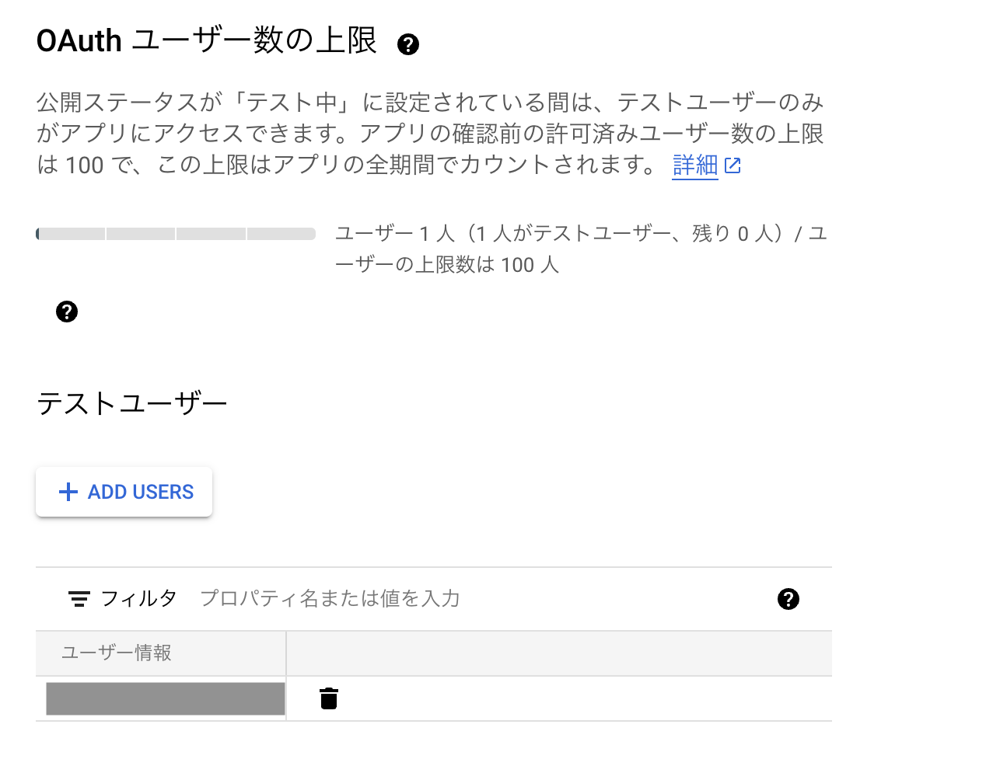
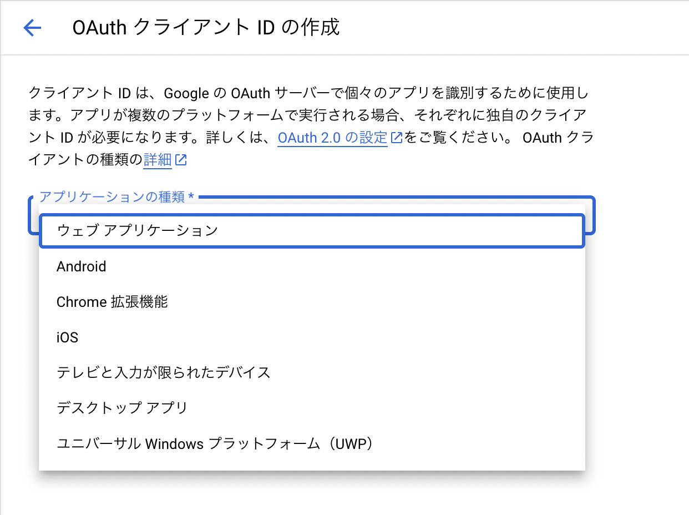

# Chrome Extension for Create Meet Link

## Google Calendar APIを利用するための準備

- [Google Cloud Platform](https://console.cloud.google.com/) にアクセス
- アプリを作成
- APIとサービスを有効化
- OAuth同意画面の設定
- 認証情報の作成

### OAuth同意画面の設定

アプリの情報を入力します。
各項目は適宜選定してください。

注意点：現状公開されているアプリではないので、テストユーザーの設定が必要。



上記の設定がないと、認証エラーとなります。

### 認証情報の作成



Chrome拡張機能を選択する。


## Google api をChrome Extensionから利用する方法

```json
{
  "manifest_version": 3,
  "name": "***",
  "version": "1.0",
  "description": "",
  "permissions": [
    "identity"
  ],
  "oauth2": {
    "client_id": "CLIENT_ID",
    "scopes": [
      "https://www.googleapis.com/auth/calendar.events"
    ]
  }
}
```

以下のコードでイベント作成が可能。

```js
chrome.identity.getAuthToken({ interactive: true }, function (token) {
  var event = {
    summary: "Sample Event",
    start: {
      dateTime: "2023-08-15T09:00:00-07:00",
      timeZone: "Asia/Tokyo",
    },
    end: {
      dateTime: "2023-08-15T17:00:00-07:00",
      timeZone: "Asia/Tokyo",
    },
  };

  var xhr = new XMLHttpRequest();
  xhr.open(
    "POST",
    "https://www.googleapis.com/calendar/v3/calendars/primary/events?access_token=" +
      token
  );
  xhr.setRequestHeader("Content-Type", "application/json");
  xhr.onload = function () {
    if (xhr.status == 200) {
      // Success
      console.log(xhr.responseText);
    } else {
      // Failure
      console.log("Error " + xhr.statusText);
    }
  };
  xhr.send(JSON.stringify(event));
});
```
